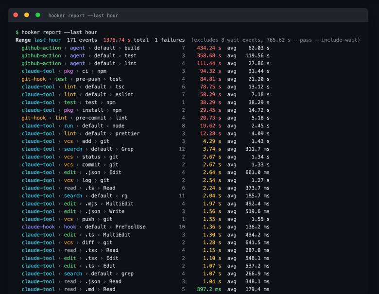
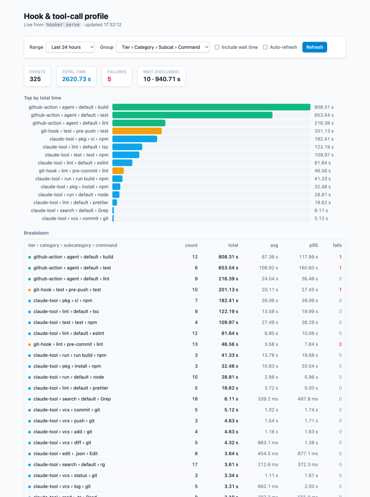

# hooker — hook & tool-call timing profiler

Captures **elapsed time** for Claude Code / Cursor hooks, tool calls, git hooks, and GitHub
Actions steps into a SQLite database, and aggregates totals by date range grouped by a derived
**tier → category → subcategory → command** taxonomy. Self-contained, zero external dependencies
(`node:sqlite`, `node:test`, inline-SVG charts); `gh` is only needed for the GitHub source.

## Screenshots

**Colorized CLI report** — `hooker report --last hour`:



**Live web report** — `hooker serve`, with range presets + custom datetime pickers:



## Install into a project

No registry — install straight from GitHub (needs Node ≥ 22.5 for `node:sqlite`):

```
npx github:rmcfadden/hooker install        # wire recorders into the current project
# or add it as a dev dependency and use the `hooker` bin:
npm i -D github:rmcfadden/hooker
npx hooker install
```

The recorders are path-referenced into `node_modules/hooker`, and timings are written to a
**project-local `.profile/`** directory (add `.profile/` to the project's `.gitignore`). Set
`$PROFILE_DATA_DIR` to override the location.

## Data model

One `event` row per timed thing. Timestamps are **integer epoch microseconds** from a
high-performance clock; elapsed is computed on read (`"end" - start`), never stored.

| tier            | hook                               | command                               |
| --------------- | ---------------------------------- | ------------------------------------- |
| `claude-hook`   | `PreToolUse` / `Stop` …            | wrapped hook script                   |
| `claude-tool`   | tool name (`Bash` …)               | executable / edited file              |
| `git-hook`      | `pre-commit` / `pre-push`          | lint step                             |
| `github-action` | `workflow/job`                     | step name                             |
| `claude-wait`   | `AskUserQuestion` / `ExitPlanMode` | user think-time (excluded by default) |
| `cursor-turn`   | `turn`                             | turn (submit → stop duration)         |
| `cursor-tool`   | `Bash`/`Edit`/`Read`/`MCP`         | executable / file (0 duration)        |

### Wait tier (`claude-wait`)

Tools that block on the user — `AskUserQuestion`, `ExitPlanMode` — measure _think-time_, not
machine work, and a single overnight prompt can dwarf every real hook. They're reclassified to
the **`claude-wait`** tier and **excluded from report groups and totals by default**; the
excluded count + duration still shows in the header. Pass **`--include-wait`** to fold them in.

### Cursor (`--host cursor`)

Cursor's hooks (v1.7+, `.cursor/hooks.json`) are point events — there is **no
`afterShellExecution`** and hooks **can't rewrite commands** — so per-command durations
aren't available. The Cursor host records **turn durations** (`beforeSubmitPrompt` → `stop`,
`cursor-turn`) and **activity counts** (`cursor-tool`, 0 duration). Recorders are
non-blocking (Cursor only enforces `deny`; they emit `allow`).

## CLI

```
hooker init | reset               # create / drop+recreate the SQLite DB
hooker ingest --github --since 2026-07-01                 # pull GitHub Actions timings
hooker report --from 2026-07-01 --to 2026-07-22           # whole-day range (wait tier excluded)
hooker report --from 2026-07-22T14:00:00 --to 2026-07-22T14:30:00   # second-precise slice
hooker report --last 1h                                   # rolling window (30s/90m/2h/1d)
hooker report --from … --to … --include-wait              # fold user think-time back in
hooker report --last 1h --no-color                        # plain text (color is on by default)
hooker report --last 1d --group category                  # roll up into vcs/test/lint/pkg/…
hooker report --from … --to … --group tier,command,subcommand --html
hooker serve [--port 4180] [--host 127.0.0.1]             # live React report UI + JSON API
hooker install [--target <dir>] [--wrap-hooks]            # wire recorders into a project
hooker install --host cursor [--global]                  # wire Cursor recorders (.cursor/hooks.json)
hooker install-git                                        # time each git-hook step in place
hooker upgrade [--host cursor]                            # re-apply the current install (run after a git pull)
hooker status / hooker uninstall [--host cursor] / hooker uninstall-git
```

**Categories & subcategories.** Every event is rolled up into a two-level taxonomy, **derived at
read time** (no stored column) from its tier/command/subcommand. The default report groups by
**`tier › category › subcategory › command`** — the leading `tier` keeps the source
(`claude-tool` / `claude-hook` / `github-action` / `git-hook`) visible, e.g.
`claude-tool › test › integration › npm`, `claude-tool › vcs › push › git`,
`claude-hook › hook › default › main-branch-guard`. Categories: **vcs** (git/gh), **test**, **lint**,
**build**, **pkg**, **search**, **sys**, **run** (other npm/npx/node), **shell** (cd/echo/sed/…
trivial builtins), **edit** / **read** (file tools), **agent** (Task/WebFetch/…), plus the
tier-driven **hook** (guards) and **wait** (excluded by default). The **subcategory** is the
specific verb/file-kind (`push`, `install`, `tsc`, a `.tsx` extension), or the literal `default`
when there's none. Regroup freely: `--group tier,command,subcommand`, `--group category`, etc.

**Color.** The text report is colorized by default — tier-tinted labels (tool cyan, hook indigo,
git-hook amber, wait purple), duration heat (green → yellow → red), dimmed counts. Disable with
`--no-color` or the standard `NO_COLOR` env var; it's auto-stripped for `--html`.

**Report ranges.** `--from`/`--to` take either a bare day (`2026-07-22`, snapped to the whole
UTC day) or a second-precise datetime (`2026-07-22T14:30:00`, interpreted in local time unless it
carries an explicit offset like `…Z`). `--last <span>` reports a rolling window ending now and
overrides `--from`/`--to`; a span is a count + unit suffix (`30s`/`90m`/`2h`/`1d`/`1w`) or a
bare/counted word (`hour`, `day`, `2weeks`).

## Web report (`hooker serve`)

`hooker serve` starts a small zero-dependency HTTP server (default `http://127.0.0.1:4180`)
that exposes the live SQLite data as JSON and serves an interactive React report:

- `GET /api/report?from=&to=&last=&group=&includeWait=` — the same payload as `hooker report`,
  re-queried per request so it always reflects the latest events.
- `GET /api/meta` — `now` plus the epoch-µs span of recorded events (used to bound the pickers).

The UI (in [`web/`](web/), Vite + React + TypeScript + Tailwind) has a **range dropdown** with
relative presets (last 15 min / hour / 6 h / 24 h / 7 days / 30 days / all time) and a **custom
range** with `datetime-local` from/to pickers, plus group-by, include-wait, and auto-refresh
controls. Changing any control re-fetches `/api/report` live.

```
cd web && npm install && npm run build   # build the bundle once
hooker serve                             # then open http://127.0.0.1:4180

# or develop the UI with hot-reload (Vite proxies /api → hooker serve):
hooker serve &                           # API on :4180
cd web && npm run dev                    # UI on :5173
```

`hooker serve` shows a build hint at `/` until `web/dist` exists; the `/api/*` routes work
regardless.

`upgrade` (alias `update`) refreshes the full wiring in one shot — recorders, guard-wrapping,
and git-hook steps — re-applying only what's already installed (add `--wrap-hooks` / `--git`
to force those on). The recorder scripts are path-referenced, so their behavior updates on
`git pull` regardless; `upgrade` just refreshes the settings/git-hook wiring.

## Capture

Hot-path recorders (`hooks/*.sh`) write **directly into SQLite** (WAL mode) via
`hooker record` — safe under parallel writers (many sessions / hooks at once). A tool
call's start lands in the `pending` table (PreToolUse) and is paired + split into
`event` rows on completion (PostToolUse); guards and git-hook steps insert completed rows.
`perl Time::HiRes` gives the µs clock; `jq` extracts payload fields. No flat file, no
offline ingest step (only GitHub timings are pulled on demand). `hooker install` adds the
two tool recorders to `.claude/settings.local.json` and, with `--wrap-hooks`, wraps existing
hooks in `.claude/settings.json` for self-timing (transparent — stdout and exit preserved).

`hooker install-git` wraps each step in the local `.git/hooks/pre-commit`/`pre-push` with
`hooks/profile-step.sh` in place (idempotent, reversible via `uninstall-git`), so every lint
step and test run is timed under the `git-hook` tier.

## Test

```
npm test        # node --test (unit + shell-integration; needs jq + perl)
```
